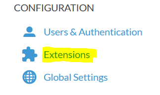
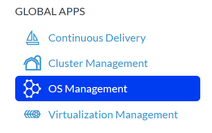
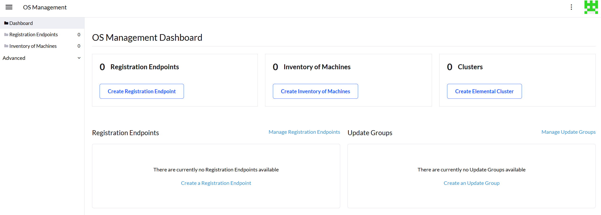

# How to use Elemental with Rancher and VMware


## Excerpt

In this document we will see how we can enable elemental support in Rancher and then build iso and test it on a vm in VMware mimicking it for an edge device.


## Prerequisites

1. Rancher 2.7 or higher installed and running.
2. One Linux machine with docker installed.


#### Part 1: Rancher Configuration.

###### 1.1 Enable the extensions under Rancher configurations menu:

 Click on extensions under the configuration menu and enable it by hitting enable.


               

Once you click on enable a dialogue box will pop up asking for confirmation and it will also notify you that the rancher extensions repository will be enabled, make sure it is checked and then confirm.


###### 1.2 Install Elemental Plugin

After the extensions are enabled under the available tab you should see elemental plugin available for installation.

 

Click on Install, this will again ask for a confirmation. Click on Install again to continue. Once the installation is finished it will ask to reload the tab. Reload it by hitting reload, post reloading you should see the elemental plugin under the installed tab.

Also this will enable the "OS Management" sub menu under the "Global Apps" menu.

  

The OS Management dashboard at this point should have nothing in it.




###### 1.3 Install the elemental operator in Rancher cluster

The next step is to install the elemental operator in Rancher Cluster. For that connect to the Rancher K8S cluster and enter the below command:

```
helm upgrade --create-namespace -n cattle-elemental-system --install elemental-operator oci://registry.opensuse.org/isv/rancher/elemental/stable/charts/rancher/elemental-operator-chart
```

 

Once the command is successful validate whether the the pod is running before continuing

```
kubectl get pods -n cattle-elemental-system
```

  

At this point we are ready to proceed with the next step, that is to prepare the ISO.


#### Part 2: Create the Machine Registration Endpoint

In the OS Management dashboard hit the create registration endpoint button

   

Now here either you can enter each detail in its respective places or you can edit this as yaml and create the endpoint in one go. Here we will edit this as yaml.

```yaml
apiVersion: elemental.cattle.io/v1beta1
kind: MachineRegistration
metadata:
  name: elemental-cls1
  namespace: fleet-default
spec:
  config:
    cloud-config:
      users:
        - name: root
          passwd: root
    elemental:
      install:
        reboot: true
        device: /dev/sda
        debug: true
      registration:
        emulate-tpm: true
        emulated-tpm-seed: 1
  machineName:
  machineInventoryLabels:
    manufacturer: "${System Information/Manufacturer}"
    productName: "${System Information/Product Name}"
    serialNumber: "${System Information/Serial Number}"
    machineUUID: "${System Information/UUID}"
```


Remove the existing content and enter this code snippet and click on save. Remember to modify this as per your need.


> name: elemental-cls1 --> "Change this as per your need"
>
> device: /dev/sda --> Make sure your target device is "sda" otherwise find out and change the naming convention here, for example in raspberry pi it could be "mmblk---" 
>
> emulate-tpm: true  --> Use this only if your target device doesnt have a tpm device and you have a way of emulating tpm like in VMware or KVM
>
> emulated-tpm-seed: 1 --> increase this by 1 for every new machine. --> If this is not given each machine will recieve the same tpm hash so at any point in time regardless of how many machines you boot it wont show up under the machine inventory.
>
> Please note: Emulate TPM is only for non-production usage like for testing as it beats the purpose of security. So in production usage use the code above without the emulate-tpm and emulate-tpm-seed


Once you create the machine registration end point it should show up as active.


 


Next click on it to view the registration url and download the initial-registration yaml

 

Hit the download button, this will download the "initial-registration.yaml" file on to your local system.

The registration yaml looks something like this:

  

We will use this file and inject its content into our vanilla elemental iso. 

#### Part 3: Create the ISO

Make sure you have initial-registration.yaml in the system where you will create the iso in this we will use a Linux vm.

Create a directory to keep everything:

`#mkdir /home/tux/elemental-demo && cd /home/tux/elemental-demo`

:q!Create a file and copy the contents of the initial-registration.yaml in it.

`#vim initial-registration.yaml`

 

Next download the script to download the iso and inject the registration.yaml in the iso and make it executable

```
wget -q https://raw.githubusercontent.com/rancher/elemental/main/.github/elemental-iso-add-registration && chmod +x elemental-iso-add-registration
```

Next execute the script and pass the initial-registration.yaml as an argument

```
./elemental-iso-add-registration initial-registration.yaml
```

 

This command will download the vanilla iso and inject it with the parameters of initial-registration.yaml and create a final iso for you to boot your end device.


> If you would like to download the vanilla ISO and reuse it later to create additional ISO's, then you can download the iso separately using the below command and then pass the local file path as an argument to the script
>
> ```
> wget https://download.opensuse.org/repositories/isv:/Rancher:/Elemental:/Stable:/Teal53/media/iso/elemental-teal.x86_64.iso 
> 
> ./elemental-iso-add-registration initial-registration.yaml /home/elemental-iso/elemental-teal.x86_64.iso
> ```


#### Part 4: Boot the target device

Now ideally you would just burn the iso to a usb drive and boot your edge device using the usb device and once it boots and become active in Rancher under machine inventory you can select and create a cluster from it, however here we will use a vm to mimic an edge device for testing.

###### 4.1 Prepare the VM to emulate TPM.

In VMware workstation create a vm the way you would do normally, make sure to give the HDD size atleast 40 GB.

Now edit the machine settings and go to the "Options" tab. The very last option would be "Advanced".

Click on "advanced" and on the right window pane change the firmware type from "BIOS" to "UEFI" and check the "Enable secure boot" option

FROM:


TO:

  

Now on the same "Options" tab click on the "Access Control" option and click on "Encrypt" on the right side.

This will ask you to enter a password to encrypt the machine. Enter a password and click on "Encrypt"

   

This is important to add the TPM Hardware. Next go back to the Hardware options and click on "Add"

And add the TPM (Trusted Platform Module) hardware and click on "Finish"

Now with the completion of this step our VM is ready. 

###### 4.2 Boot the VM with the elemental ISO

Next add the ISO that we created earlier in the VM and boot it up.

It should boot up with the ISO and start installing Elemental and 

   

And once it is complete it will reboot the VM and it should show up as active under the machine inventory in Rancher.


While Booting:                                                          Post Completion of installation:

   


#### Part 5: Create a cluster on the machine.

Once the machine shows up as active, select it and hit "Create Elemental Cluster".

 

At this stage you get a pretty familiar page of creating a cluster in Rancher. 

Give the cluster a name select the Kubernetes version and hit "Create". 

For this we have selected to create a K3S cluster.

 

Now under the Cluster Management page the cluster should show up as creating:

 

And once the cluster is fully provisioned it should be active with provider type as "Elemental".

 

Now you can start deploying application on this cluster the normal way.
